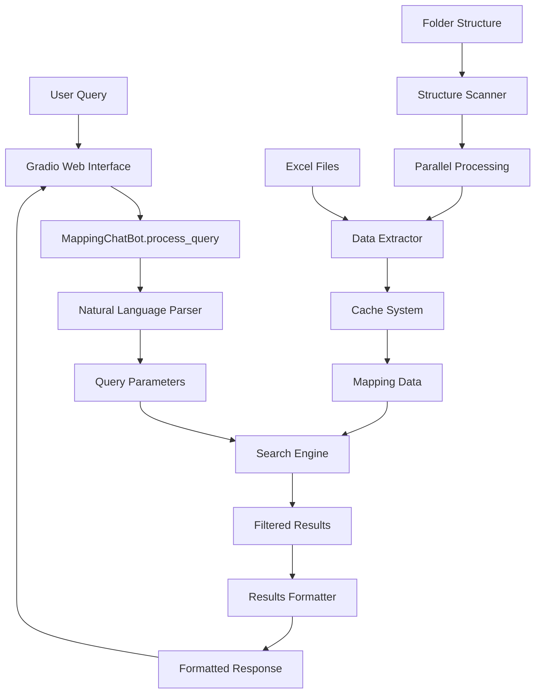
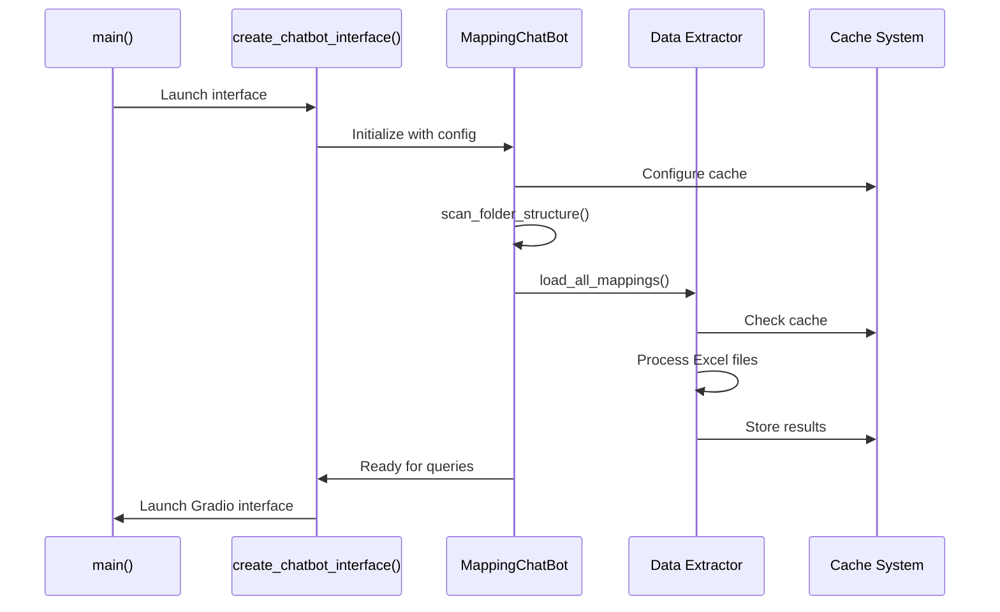
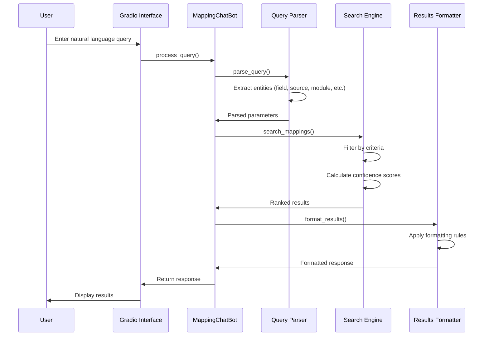

# RAFM Chatbot - Application Summary

## Overview

The RAFM (Revenue Assurance and Fraud Management) Chatbot is a sophisticated Python application that provides a natural language interface for querying field mappings from structured Excel files. The application uses Gradio for the web interface and implements advanced caching, parallel processing, and intelligent search capabilities to efficiently handle large datasets.

## Application Purpose

The chatbot serves as a knowledge retrieval system that allows users to:
- Query field mappings using natural language
- Search across multiple vendors, sources, and modules
- Access mapping logic and expressions from Excel files
- Filter results by various dimensions (source, module, vendor, operator)
- Get confidence-scored results with file provenance

## Architecture Overview

### Core Components

1. **Web Interface** ([`src/app.py`](src/app.py:1))
   - Gradio-based web UI
   - Provides chat interface with example queries
   - Handles user interactions and displays results

2. **Chatbot Engine** ([`src/chatbot.py`](src/chatbot.py:1))
   - Natural language query processing
   - Intelligent field matching with confidence scoring
   - Results formatting and presentation
   - Cache management integration

3. **Data Extractor** ([`src/extractor.py`](src/extractor.py:1))
   - Excel file processing and data extraction
   - Support for both standard and dynamic column detection
   - File provenance tracking
   - Parallel processing capabilities

4. **Caching System** ([`src/cache.py`](src/cache.py:1))
   - File-based caching for Excel extraction results
   - TTL-based cache invalidation
   - Performance optimization
   - Cache size management

## Data Flow Architecture



## Detailed Code Flow

### 1. Application Initialization



### 2. Query Processing Flow



## Key Features

### 1. Natural Language Processing
- **Query Parsing**: Sophisticated regex-based entity extraction
- **Field Matching**: Multiple matching strategies with confidence scoring
  - Exact match (100% confidence)
  - Underscore/space variation (95%)
  - Prefix matching (85%)
  - Contains matching (70%)
  - Word similarity (60%)
  - Levenshtein distance (50-30%)

### 2. Data Extraction
- **Standard Extraction**: Fixed column mapping (B, C, D columns)
- **Dynamic Extraction**: Automatic column detection for PI modules
- **File Provenance**: Tracks which file each expression comes from
- **Operator Extraction**: Derives operator names from filenames

### 3. Performance Optimization
- **Parallel Processing**: ThreadPoolExecutor for concurrent file processing
- **Intelligent Caching**: File-based cache with TTL and size management
- **Progress Tracking**: Real-time progress bars during loading
- **Memory Efficiency**: Streaming Excel processing with read-only mode

### 4. Search Capabilities
- **Multi-dimensional Filtering**: Source, module, source_name, vendor, operator
- **Fuzzy Matching**: Intelligent field name matching
- **Confidence Scoring**: Results ranked by match quality
- **Expression Filtering**: Removes invalid Excel errors (#REF!, #N/A, etc.)

## Data Structure

### Folder Hierarchy
```
Root Folder/
├── Source/
│   ├── Module/
│   │   ├── SourceName/
│   │   │   ├── Vendor/
│   │   │   │   └── LdRules/
│   │   │   │       ├── ExcelFile1.xlsx
│   │   │   │       ├── ExcelFile2.xlsx
│   │   │   │       └── ...
```

### Data Model
- **Mapping Key**: (dimension, field) tuple
- **Mapping Value**: List of expression strings
- **File Tracking**: Unique filenames per mapping
- **Expression Provenance**: Filename for each expression

## Configuration

### Cache Configuration
- **Cache Directory**: `./cache` (configurable)
- **Max Cache Size**: 500MB (configurable)
- **Cache TTL**: 24 hours (configurable)
- **Cache Validation**: File modification time + content hash

### Processing Configuration
- **Parallel Workers**: 8 (configurable)
- **Excel Columns**: B (Dimension), C (Field), D (Value)
- **Header Rows**: 2 (configurable)
- **Dynamic Columns**: D-H for PI modules

## API Interface

### Core Methods

#### MappingChatBot.process_query(query)
Processes natural language queries and returns formatted results.

#### MappingChatBot.parse_query(query)
Extracts entities from natural language using regex patterns.

#### MappingChatBot.search_mappings(parsed_query)
Searches through loaded data with confidence scoring.

#### extract_combined_field_mappings_from_folder()
Extracts mappings from Excel files with standard column layout.

#### extract_dynamic_mapping_column_from_folder_for_pi()
Extracts mappings with dynamic column detection for PI modules.

## Special Commands

- `help` - Display comprehensive help guide
- `list` or `sources` - Show all available data sources
- `stats` - Display loading statistics and top vendors
- `cache stats` - Show cache performance metrics
- `clear cache` - Clear all cached files

## Error Handling

### Robust Error Management
- **File Processing**: Graceful handling of corrupted Excel files
- **Cache Operations**: Fallback to direct processing on cache failures
- **Query Processing**: Validation and sanitization of user inputs
- **Expression Filtering**: Automatic removal of Excel error values

### Logging and Monitoring
- **Progress Tracking**: Real-time progress bars during operations
- **Performance Metrics**: Cache hit rates, processing times
- **Error Reporting**: Detailed error messages with context

## Security Considerations

- **Path Validation**: Prevents directory traversal attacks
- **File Type Checking**: Only processes .xlsx files
- **Input Sanitization**: Regex-based query validation
- **Cache Isolation**: Separate cache files per extraction parameters

## Performance Characteristics

### Scalability
- **Large Dataset Support**: Handles thousands of Excel files
- **Memory Efficiency**: Streaming processing with minimal memory footprint
- **Concurrent Processing**: Parallel loading with configurable workers

### Response Times
- **Cached Queries**: Sub-second response for cached data
- **New Queries**: 2-5 seconds depending on result size
- **Initial Loading**: 10-30 seconds for large datasets (with parallel processing)

## Integration Points

### External Dependencies
- **Gradio**: Web interface framework
- **OpenPyXL**: Excel file processing
- **TQDM**: Progress bars and tracking
- **HuggingFace Hub**: Model and dependency management

### Environment Variables
- `MAPPING_ROOT_FOLDER`: Root directory for Excel files
- Cache configuration parameters
- Processing performance settings

## Future Enhancements

### Potential Improvements
- **ML-based Query Understanding**: Replace regex with NLP models
- **Database Backend**: Replace file-based storage with database
- **Real-time Updates**: Watch for file changes and auto-refresh
- **Advanced Analytics**: Usage patterns and query optimization
- **API Endpoints**: RESTful API for programmatic access

## Conclusion

The RAFM Chatbot represents a sophisticated approach to knowledge retrieval from structured Excel data. It combines modern web interfaces, intelligent search algorithms, and performance optimization techniques to deliver a user-friendly solution for complex data exploration tasks. The modular architecture ensures maintainability while the comprehensive caching system provides excellent performance for enterprise-scale deployments.